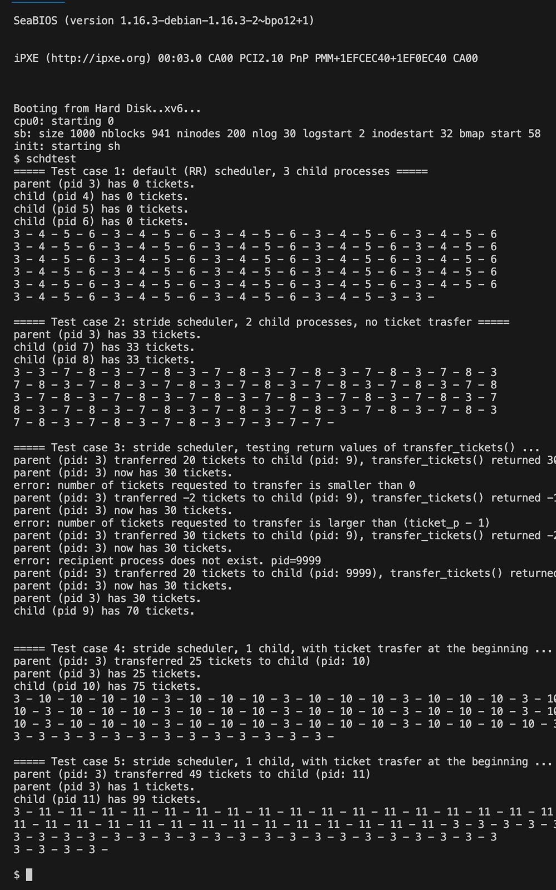

# CS350 Operating Systems - Project 2

## Overview
This project extends the xv6 operating system with two key features:
1. Race condition control after fork()
2. Stride scheduling implementation

## 1. Race Condition After fork()

### Implementation
- Modified `proc.c` to allow controlling which process (parent or child) runs first after fork()
- Added system call `fork_winner(int)` to set the policy:
  - `fork_winner(0)`: Parent runs first (default xv6 behavior)
  - `fork_winner(1)`: Child runs first (new behavior)
- Test with `fork_rc_test` program

## 2. Stride Scheduler

### Implementation
- Added proportional share scheduling as an alternative to Round Robin
- System calls:
  - `set_sched(int)`: Switch between RR (0) and stride scheduling (1)
  - `tickets_owned(int pid)`: Get number of tickets owned by a process
  - `transfer_tickets(int pid, int tickets)`: Transfer tickets between processes

### Stride Scheduling Details
- 100 total tickets distributed among all active processes
- Process with lowest pass value gets scheduled
- Pass values updated by adding stride after running
- Tickets determine scheduling priority
- Processes can transfer tickets to others

### Testing
- `schdtest` program tests all functionality
- Includes 5 test cases for different scheduling scenarios

## Changes Made
- Modified `proc.c` and `proc.h` to support new scheduling features
- Added stride and pass values to process structure
- Added `STRIDE_TOTAL_TICKETS = 100` to `param.h`
- Implemented ticket redistribution after process state changes
- Added logic to scheduler to choose between stride and RR

## Bug Fixes
- Fixed ticket transfer return values
- Fixed ticket distribution when switching scheduling modes
- Fixed pass value update timing in scheduler
- Resolved page fault issues in stride scheduler

## About Stride Scheduling
Stride scheduling is a proportional-share CPU scheduling algorithm that allocates CPU time in proportion to the number of tickets each process owns. Key characteristics:

- Each process has tickets that represent its share of CPU time
- Processes with more tickets get proportionally more CPU time
- Each process maintains stride and pass values
- Stride value is inversely proportional to tickets (fewer tickets = larger stride)
- Pass value increases by stride amount each time a process runs
- Process with lowest pass value runs next
- Provides fair CPU allocation based on process priority
- Prevents starvation through implicit aging mechanism

## Sample Output
Below is the output of running the test cases that verify both the Round Robin and Stride scheduling implementations:

The output shows:
- Test case 1: Round Robin scheduling with 3 child processes
- Test case 2: Stride scheduling with even ticket distribution
- Test case 3: Testing return values of transfer_tickets()
- Test case 4: Stride scheduling with ticket transfer (25 to parent, 75 to child)
- Test case 5: Stride scheduling with extreme ticket transfer (1 to parent, 99 to child)